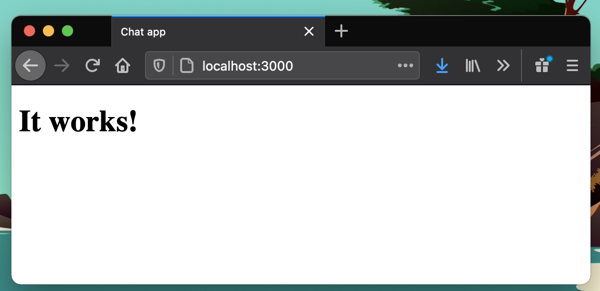
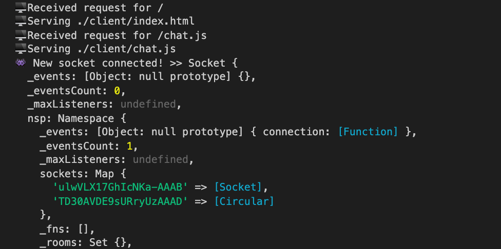
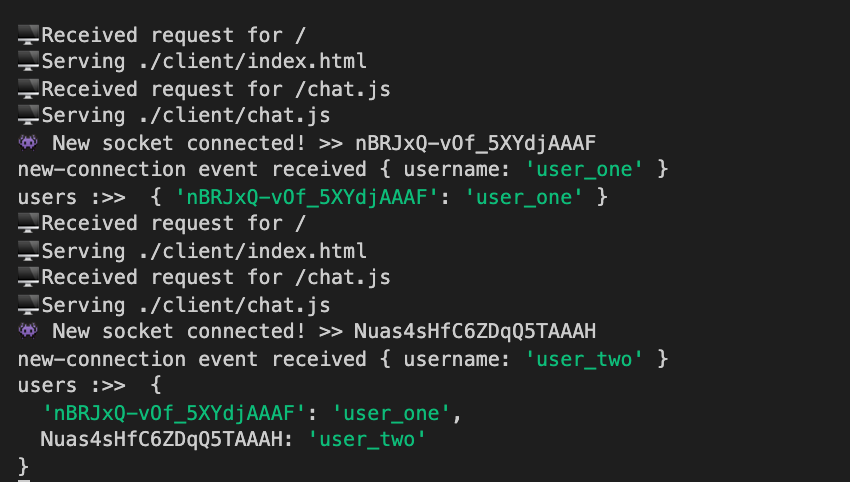
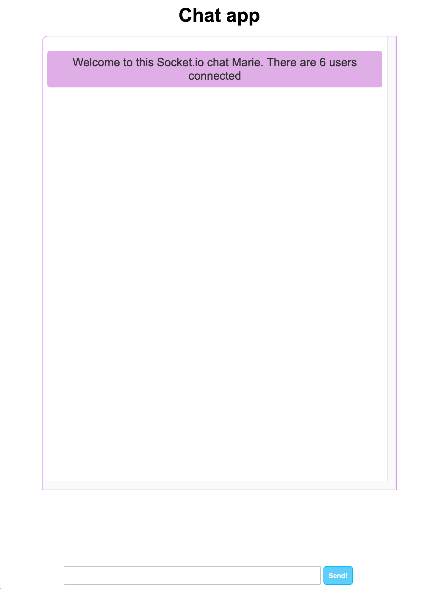

## What is socket.io

Socket.io is a Javascript library for web apps that allows real time communication between clients and servers. It's built on top of the Websockets API (client) and Node.js (server). If you want to learnt what Websockets are, watch [this super quick video](https://www.youtube.com/watch?v=ZbrEztkwcw8 'websockets explained') to understand the basic concepts.
The most common use cases for Websockets and socket.io are chat applications or a social media feeds in which a user's page (client) receives messages or posts from other users.

In this article we'll build a simple chat application that allows users to talk to each other in real time. Our application will consist in two separate components, a server and a client, each one with different responsabilities:

### Chat server responsabilities

- Serve the HTML, CSS and JavaScript client files to the users
- Start the Socket.io connection
- Receive events from clients (like a new chat message) and broadcast them to other clients

### Chat client responsabilities

- Load socket.io client library from a CDN
- Stablish connection with the Socket.io running in our server
- Ask user to enter his name so we can identify him in the chat
- Emit and receive events to/from Socket.io running in our server
- Add our own messages to the chat via JavaScript

Now that we know what do we need to build, let's start coding!

## Setting up the web server

Let's start by initialising our project running npm init.
The first responsability we need to take care of is creating a web server that serves the HTML, CSS and JavaScript files to our clients. To do so, we'll use Node's integrated http module. We'll create a file named server.js and include the following code:

```js
var http = require('http')
var fs = require('fs')
var path = require('path')
const APP_PORT = process.env.APP_PORT || 3000
const app = http.createServer(requestHandler)

app.listen(APP_PORT)
console.log(`🖥 HTTP Server running at ${APP_PORT}`)

// handles all http requests to the server
function requestHandler(request, response) {
  console.log(`🖥 Received request for ${request.url}`)
  // append /client to serve pages from that folder
  var filePath = './client' + request.url
  if (filePath == './client/') {
    // serve index page on request /
    filePath = './client/index.html'
  }
  var extname = String(path.extname(filePath)).toLowerCase()
  console.log(`🖥 Serving ${filePath}`)
  var mimeTypes = {
    '.html': 'text/html',
    '.js': 'text/javascript',
    '.css': 'text/css',
    '.png': 'image/png',
    '.jpg': 'image/jpg',
    '.gif': 'image/gif',
    '.svg': 'image/svg+xml',
  }
  var contentType = mimeTypes[extname] || 'application/octet-stream'
  fs.readFile(filePath, function (error, content) {
    if (error) {
      if (error.code == 'ENOENT') {
        fs.readFile('./client/404.html', function (error, content) {
          response.writeHead(404, { 'Content-Type': contentType })
          response.end(content, 'utf-8')
        })
      } else {
        response.writeHead(500)
        response.end('Sorry, there was an error: ' + error.code + ' ..\n')
      }
    } else {
      response.writeHead(200, { 'Content-Type': contentType })
      response.end(content, 'utf-8')
    }
  })
}
```

In summary, the code above starts a server that handles requests and serves files contained in a folder named client .

Now we go ahead and create a folder named client with an index.html file inside it with the following content:

```html
<!DOCTYPE html>
<html lang="en">
  <head>
    <meta charset="UTF-8" />
    <meta name="viewport" content="width=device-width, initial-scale=1.0" />
    <meta http-equiv="X-UA-Compatible" content="ie=edge" />

    <title>Chat Socket.io Demo</title>
  </head>
  <body>
    <h1>It works!</h1>
  </body>
</html>
```

To test if this works, modify the package.json file to run our server.js file on the start script:

```sh
{
  "name": "chatsocket.io",
  "version": "1.0.0",
  "description": "A chat that uses socket.io",
  "main": "server.js",
  "scripts": {
    "start": "node server.js"
  },
  "keywords": [
    "chat",
    "socket.io"
  ],
  "author": "Super Coder",
  "license": "ISC",
  "dependencies": {
  }
}
```

Now run npm start and open http://localhost:3000 in your browser to see our index page.



## Initialising Socket.io in the server and client

Our basic web server is working and serving HTML files (we'll take care of serving JavaScript and CSS files in a bit 😉) so now we can start working on our chat. Install socket.io by running `npm i socket.io` and then include the following lines into our _server.js_ file:

```js
// SOCKET.IO CHAT EVENT HANDLING
const io = require('socket.io')(app, {
  path: '/socket.io',
})

io.attach(app, {
  // includes local domain to avoid CORS error locally
  // configure it accordingly for production
  cors: {
    origin: 'http://localhost',
    methods: ['GET', 'POST'],
    credentials: true,
    transports: ['websocket', 'polling'],
  },
  allowEIO3: true,
})

io.on('connection', (socket) => {
  console.log('👾 New socket connected! >>', socket.id)
})
```

Let's see what this code does:

- Imports socket.io and attach it to our app server
- With `io.on('connection)` we detect a new connection and log a message in the console including the socket object, which will contain some information from the client.

Now we have to modify our index.html document to load the socket.io library from a CDN and also load a `chat.js` file that we're going to create inside the _client_ folder our server:

```html
<!DOCTYPE html>
<html lang="en">
  <head>
    <meta charset="UTF-8" />
    <meta name="viewport" content="width=device-width, initial-scale=1.0" />
    <title>Chat app</title>
    <!-- load Socket.io library -->
    <script
      src="https://cdnjs.cloudflare.com/ajax/libs/socket.io/3.1.1/socket.io.js"
      integrity="sha512-oFOCo2/3DtjrJG4N27BjSLQWoiBv171sK6a+JiWjp/7agxC2nCUP358AqzxkBUb5jX8g6CYLPdSKQTbC0weCwA=="
      crossorigin="anonymous"
    ></script>
    <!-- Script to emit/receive events from socket.io server -->
    <script defer src="chat.js"></script>
  </head>
  <body>
    <h1>It works!</h1>
  </body>
</html>
```

In **the `chat.js` file we will add all the code to emit and handle events for our chat.** For now, it will just have the following code which connects the client to the Socket.io instance running on the host that served the page (our server):

```js
// FILE /client/chat.js

console.log('chat.js file loaded!')

// IMPORTANT! By default, socket.io() connects to the host that
// served the page, so we dont have to pass the server url
var socket = io.connect()
```

If we test this, we'll see that the page loads both JavaScript files and in our server console we'll see the "👾 New socket connected!" message.



If we open multiple tabs/windows, we'll see multiple messages in our server console.

## Creating the chat

Now that we have our Socket.io instance running in the server and our client (the page) connected to it, it's time to move on and start creating our chat

### Storing the connected clients

Let's start by storing the information of each client connected to our server. To identify each client, we'll ask the users to enter their name in a promts and aditionally, we'll save their socket id. Modify your `chat.js` file like this:

```js
// FILE /client/chat.js

console.log('chat.js file loaded!')

// IMPORTANT! By default, socket.io() connects to the host that
// served the page, so we dont have to pass the server url
var socket = io.connect()

//prompt to ask user's name
const username = prompt('Welcome! Please enter your name:')

// emit event to server with the user's name
socket.emit('new-connection', { username })

// captures welcome-message event from the server
socket.on('welcome-message', (data) => {
  console.log('received welcome-message >>', data)
})
```

We're using the _prompt()_ method to request the username. With _socket.emit()_ we're emmitting to our server. The first paramenter is the event name and the second paramenter is the data we're sending, in this case, just the username. Using _socket.on()_ we capture events sent from the server to the clients.

In our server, we have to capture the event like this:

```js
// To save the list of users as id:username
var users = {}

io.on('connection', (socket) => {
  console.log('👾 New socket connected! >>', socket.id)
  // use socket.on() to capture different events
  socket.on('new-connection', (data) => {
    // captures event when new clients join
    console.log(`new-connection event received`, data)
    // saves user to list
    users[socket.id] = data.username
    console.log('users :>> ', users)
    // emit welcome message event
    socket.emit('welcome-message', {
      user: 'server',
      message: `Welcome to this Socket.io chat ${data.username}. There are ${
        Object.keys(users).length
      } users connected`,
    })
  })
})
```

As you can see, we've added a users object in which we'll store all the users connected. To capture the event sent from the client, we use the _socket.on()_ method which receives the data sent from the client, containing the username. After we save the user details we emit another event, this time from the server to the client with a welcome message.



In summary, the most used functions when working with Socket.io are _socket.emit(eventName, data)_ and _socket.on(eventName, data)_ to emit and capture events in both the server and the clients. As a rule of thumb, just remember to have an _socket.on()_ function for each event you send with _socket.emit()_

### Handling chat messages

Now that we know how to emit and handle events in both the client and the server, we can start working on the events to send and receive chat messages. But first we need to create the HTML input to enter the message to send and the container that will hold all the conversation's messages.

```html
<!DOCTYPE html>
<html lang="en">
  <head>
    <meta charset="UTF-8" />
    <meta name="viewport" content="width=device-width, initial-scale=1.0" />
    <title>Chat app</title>
    <script
      src="https://cdnjs.cloudflare.com/ajax/libs/socket.io/3.1.1/socket.io.js"
      integrity="sha512-oFOCo2/3DtjrJG4N27BjSLQWoiBv171sK6a+JiWjp/7agxC2nCUP358AqzxkBUb5jX8g6CYLPdSKQTbC0weCwA=="
      crossorigin="anonymous"
    ></script>

    <!-- Script to emit/receive events from socket.io server -->
    <script defer src="chat.js"></script>

    <!-- Stylesheet -->
    <style>
      body {
        font-family: Arial, Helvetica, sans-serif;
        box-sizing: border-box;
      }
      #app {
        width: 85vw;
        margin: 0 auto;
      }
      #chatContainer {
        height: 75vh;
        border: 1px solid #e095fd;
        border-radius: 10px;
        margin: 1rem 1rem;
        padding: 0.5rem;
        overflow: scroll;
      }
      #messageForm {
        width: 80%;
        position: absolute;
        bottom: 10px;
      }
      .input {
        margin: auto;
        padding: 0.5rem;
        margin: 0 0.5rem;
        width: 70%;
        border: 1px solid #c2c2c2;
        border-radius: 2px;
      }
      .input:active,
      .input:focus {
        border-color: #9de3ff;
      }

      .btn {
        padding: 0.5rem;
        background-color: #5fcefa;
        border: 1px solid #06b8ff;
        border-radius: 5px;
        color: #fff;
        font-weight: 600;
      }
      .center {
        text-align: center;
        margin: 0 auto;
      }
      .error {
        border-color: #fa7962 !important;
      }
      /* default message styling for server notifications */
      .message {
        background-color: rgb(223, 174, 230);
        color: #333;
        font-size: 1.2rem;
        text-align: center;
        border-radius: 5px;
        padding: 0.5rem;
        margin-top: 1rem;
      }
      /* change colors and alignment for self and others messages */
      .self-message {
        background-color: #ccffcc;
        text-align: right;
      }
      .others-message {
        background-color: aqua;
        text-align: left;
      }
    </style>
  </head>
  <body>
    <div id="app">
      <h1 class="center">Chat app</h1>

      <!-- Chat messages will be appended inside this container -->
      <div id="chatContainer"></div>

      <!-- Form to enter and submit new chat messages -->
      <div class="center">
        <form id="messageForm">
          <input class="input center" type="text" id="messageInput" />
          <button class="btn" type="submit" id="sendBtn">Send!</button>
        </form>
      </div>
    </div>
  </body>
</html>
```

I'm including some styles to help us position all the elements and differenciate between our own and other user's messages on the chat. There is an empty container with id _chatContainer_ in which we'll append any messages. At the bottom, there is a form with the input and button to send the messages.

Moving to our `chat.js` file, we'll create a helper function _addMessage()_ to append messages to the _chatContainer_ and invoke it right after we receive the _welcome-message_ event from the server.

```js
socket.on('welcome-message', (data) => {
  console.log('received welcome-message >>', data)
  // adds message, not ours
  addMessage(data, false)
})

// receives two params, the message and if it was sent by yourself
// so we can style them differently
function addMessage(data, isSelf = false) {
  const messageElement = document.createElement('div')
  messageElement.classList.add('message')

  if (isSelf) {
    messageElement.classList.add('self-message')
    messageElement.innerText = `${data.message}`
  } else {
    if (data.user === 'server') {
      // message is from the server, like a notification of new user connected
      // messageElement.classList.add('others-message')
      messageElement.innerText = `${data.message}`
    } else {
      // message is from other user
      messageElement.classList.add('others-message')
      messageElement.innerText = `${data.user}: ${data.message}`
    }
  }
  // get chatContainer element from our html page
  const chatContainer = document.getElementById('chatContainer')

  // adds the new div to the message container div
  chatContainer.append(messageElement)
}
```

This function will receive a _data_ object which will contain the username and the message itself, and a _isSelf_ flag which indicates if the message is ours. We'll use this second parameter to choose a different style to display the message. This is how it'll look like:



The next step is to send messages from a client and broadcast them to all the other clients. We'll have to add an event listener in our submit button and, as we've done before, use the _socket.emit()_ function in the client to send the message to our server. We'll also add another event handler for _broadcast-message_ which we'll emit from the server when other clients send a message:

```js
const messageForm = document.getElementById('messageForm')

messageForm.addEventListener('submit', (e) => {
  // avoids submit the form and refresh the page
  e.preventDefault()

  const messageInput = document.getElementById('messageInput')

  // check if there is a message in the input
  if (messageInput.value !== '') {
    let newMessage = messageInput.value
    //sends message and our id to socket server
    socket.emit('new-message', { user: socket.id, message: newMessage })
    // appends message in chat container, with isSelf flag true
    addMessage({ message: newMessage }, true)
    //resets input
    messageInput.value = ''
  } else {
    // adds error styling to input
    messageInput.classList.add('error')
  }
})

socket.on('broadcast-message', (data) => {
  console.log('📢 broadcast-message event >> ', data)
  // appends message in chat container, with isSelf flag false
  addMessage(data, false)
})
```

As you can see, we're calling the _addMessage_ function to append our own message to the chat container without involving our server.

Now in our server, we need to capture the _new-message_ event using the _socket.on()_ method and emit the _broadcast-message_ event:

```js
// FILE: server.js

//...

// To save the list of users as id:username
var users = {}

io.on('connection', (socket) => {
  console.log('👾 New socket connected! >>', socket.id)

  // handles new connection
  socket.on('new-connection', (data) => {
    // captures event when new clients join
    console.log(`new-connection event received`, data)
    // adds user to list
    users[socket.id] = data.username
    console.log('users :>> ', users)
    // emit welcome message event
    socket.emit('welcome-message', {
      user: 'server',
      message: `Welcome to this Socket.io chat ${data.username}. There are ${
        Object.keys(users).length
      } users connected`,
    })
  })

  // handles message posted by client
  socket.on('new-message', (data) => {
    console.log(`👾 new-message from ${data.user}`)
    // broadcast message to all sockets except the one that triggered the event
    socket.broadcast.emit('broadcast-message', {
      user: users[data.user],
      message: data.message,
    })
  })
})
```

Notice that when the server receives the _new-message_ event, now we're using _socket.broadcast.emit()_ instead of just _socket.emit()_. The difference is that **when broadcasting, we're sending an event to all clients except the one that sent the original event.**

Give it a try and...


There are a couple of things we can do to improve this chat a little bit. For example, we can detect when a client disconnects and send a message to the remaining users. You can find that in the full code in this repository.

## Conclussion

Socket.io is a super powerful library and we've just scratched some basic methods from its API but it contains a lot more functionalities like assigning namespaces to sockets so they have different endpoints, create rooms and even integrate it with Redis. Make sure to [check out their documentation](https://socket.io/docs/v3/index.html) to learn more.

I hope you find this article useful and it help you create awesome projects using Socket.io!
